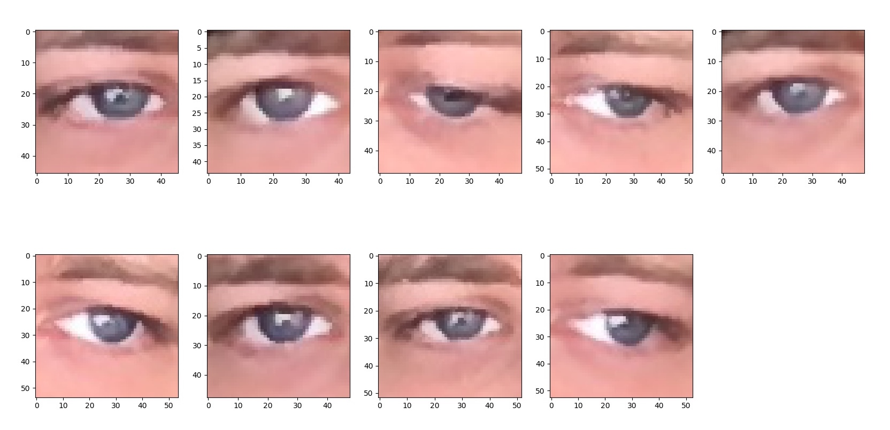
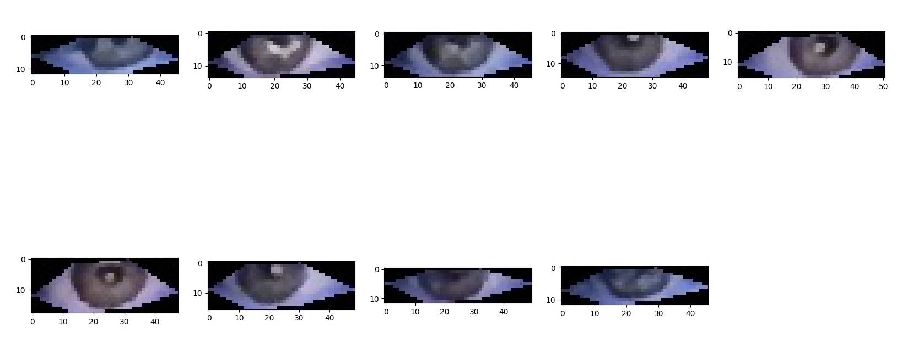

# EyeMouse

This is a small Deep Learning experiment I'm working on right now. I want to use this readme to document my progress. 

I'm trying to build an app that takes a webcam image, extracts the eye from the face and maps it to the x/y coordinates location of where the user is looking.


# Experiment #1

Files can be found inside `experiment_1/`

I want to see if this problem is learnable, i.e. if I can use the power of Neural Networks to get to a working solution. I just want to see what happens if I feed a few hundreds images to a rather simple net. If the loss is decreasing, it's a good start. So I reduce my problem to only predicting the x-coordinate from one image of the eye only (I want to use both eyes down the line if things look promising, but it requires a slightly more complex network). 

So I've created a small network with PyTorch and collected 3000 images using `cv2.CascadeClassifiers`. Every time an image was taken with my webcam, I was looking at my cursor and saved its x-coordinate pixel location using `pyautogui` (see [experiment_1/collect_data.py](experiment_1/collect_data.py)). I then made a small script to get the image path and its corresponding coordinate in a .csv file (see [experiment_1/create_data_csv.py](./experiment_1/create_data_csv.py)). This is to help PyTorch create a `Dataset` easily.



There's both the left and right eye in this dataset, and it was quite hard to get cv2 to collect only one eye. So in the end I opted to keep both. 

I trained my nework locally and the RMSE loss went from +- 900px down to +- 500px. So everytime the network made a prediction, it is off by around 500px, which isn't great BUT because the network is learning it seems promising.

This motivated me to work more on this project and improve its accuracy.

# Experiment #2

Files can be found inside `experiment_2/`

I decided that the first step to improve my model would be to collect not only more data, but better quality data as well. Looking at the data I used initially, there's a ton of noise: I'm getting a much bigger part of my face instead of just my eye.

So I look up for a better "eye extraction" method, and I found the amazing `face_recognition` library. It uses `dlib`'s deep learning models under the hood, and they are *insanely* accurate at doing all sorts of tasks related to face detection. I created another script that also recorded my webcam + position of the cursor, and collected around 1000 images (see [experiment_2/collect_data.py](experiment_2/collect_data.py)).



That's much better. I retrained my network with high hopes and... it converged to an RMSE of around 500px. So I thought that the problem might come from the model itself. In his [Recipe for Training Neural Networks](http://karpathy.github.io/2019/04/25/recipe/), Andrej Karpathy gives a few heuristics for training neural nets. One of them is performing a small "overfit check", i.e. letting the model overfit on a small sample of the training data, and checking if the loss goes near 0. If it doesn't, then there's a problem with the model. 

So I tried on a sample of 10 images (see [experiment_2/overfit_dataset.csv](experiment_2/overfit_dataset.csv)), and the network didn't overfit. I looked into my code and after (a ton of) research, it turned out that I had forgotten to normalize my targets. So my network was trying to predict values... in the `[0, 1600]` range! I normalized my targets and my network was finally overfitting.  

# Next steps

* Retrain on the 1000 images and (normalized) targets and see where this goes. 
* Collect (way) more data
* Build network that accepts two images (left and right eye) and the x,y coordinate of the head w.r.t the screen. 
* Create multi-ouput regression model (at the moment it only predicts the x-location).
* Do hyperparameters search with `wandb`.
* (maybe, if things don't work) Turn this into a classification problem, where I predict a part of the screen instead of exact coordinates. 
````